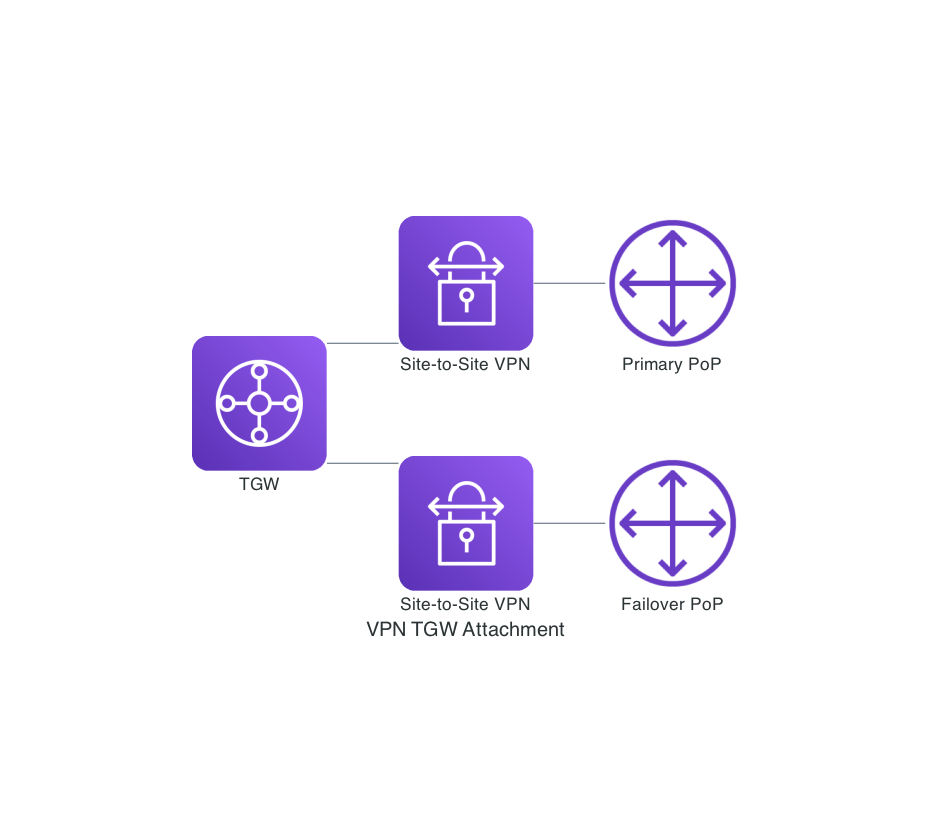

# VPN TGW Attachment

This repository is to demostrate how to:

- Create Site-to-Site VPNs and attach them to Transit Gateway
- Use custom resource to tag the above attachments
- Use custom resource to add the Transit Gateway route table associations

Why we need the custom resource here? The is because [AWS::EC2::VPNConnection](https://docs.aws.amazon.com/AWSCloudFormation/latest/UserGuide/aws-resource-ec2-vpn-connection.html) does not return the transit gateway attachment ID.

As the following diagram shows, we build two Site-to-Site VPN connections - one to primary PoP, the other is to the failover PoP. We attach these two VPN connections to the transit gateway, then tag the attachmens and also associate them with the given route table.

_Note: Routing management (e.g auto failover) is not included in this demo, this is under the assumption that routings are handled seperately in the given route table._

